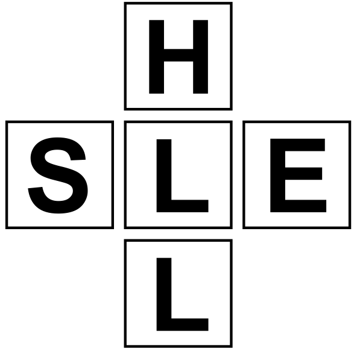

## The SHELL Model
- Considers the relationship between Hardware, software, liveware and the environment

### Liveware/Liveware
- Represents the interaction between people, i.e.
    - Relationship between crew
    - Communication with ATC
    - or Operations and Management

### Liveware/Software
- Represents interaction between people and software, i.e.
    - Computer software
    - Charts
    - Checklists
    - Manuals
- A well-designed SL interface would ensure there is no room for misunderstanding
    - Written instructions must be clear and unambiguous
    - Symbols standardized and as instinctively understandable as possible
    - Books and computer programs mist be easy to use

### Liveware/Hardware
- Represents the mechanical environment around the pilot
    - Switches and controls must be easy to use
        - and where possible standardized between aircraft types
    - Direction of control movement must be considered
        - as must the design of the controls
### Environment/Liveware
- Environment affects the fitness of the pilot to operate the equipment around him
    - Hypoxia
    - Heat and Cold
    - Radiation
    - Toxic Substances
    - Weather
### Liveware
- The Pilot
    - Center of concern, hence center of the model 