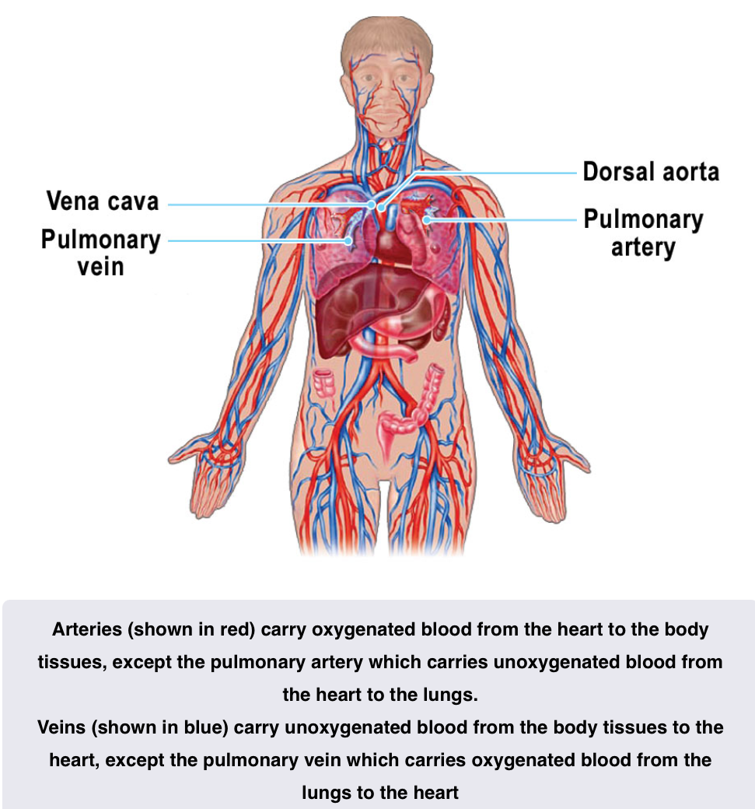

# Circulation

## The Circulatory System
- Blood is pumped around the body by the heart
- Blood vessels coming from the heart are called arteries
- Those returning blood to the heart are veins
- Arteries branch through the tissues becoming smaller and smaller until the walls are one cell thick
- These fine vessels permeate the body tissue and form the link between arteries, the arterial system, the veins, the venous system, they are called capillaries 

## The Heart
- The main vessel from the heart to the rest of the body is aorta
    - Runs down inside the spine
- Main vessel back into the heart is called the vena cava
- Vessels going from the heart and back are called the pulmonary arteries and veins respectfully

- Vessels that supply the heart from the aorta are called coronary arteries
- Coronary veins take the blood back to the vena cava
- Failure of the coronary arteries means the heart can not get enough oxygen
- Heart has 4 internal chambers
    - Main and very muscular chambers are called - **Ventricles**
    - Upper and weaker chambers are called the Left and Right Atrium - Or collectedly the atria

- The major contraction of the heart is a contraction of the ventricles
- Blood is pumped from the right ventricle through the pulmonary artery to the lungs
- Blood returning from the lungs collects in the left atrium where it injected into the left ventricle
- Power stroke from the left ventricle pumps blood into the dorsal aorta
- Both ventricles contract together and both atria contract together to give the heart its rhythm
- Pulse is about 72 bpm for a body at rest
- Pulse is controlled by the nervous system which reacts to:
    - the amount of glucose in the blood
    - the amount of exercise
    - the amount of carbon dioxide
    - the hormone adrenaline 
- Each pump of the ventricle pumps about 70 ml of blood (The stroke Volume)
- Cardiac output is stroke volume * Heart Rate
    - about 5L a min for an adult at rest

### Blood Pressure
- Arterial blood pressure is sensed by nerves in cavities called sinuses
    - there are a pair of sensors in the main arteries to the brain and another on the aorta at the top of the heart
    - These are called the carotid sinus and aortic arch pressoreceptors
        - Collectedly known as the arterial pressoreceptors 
    - Blood pressure is regulated by the brain
        - varying the amount of secretion of two hormones in response to the pressoreceptors
        - Which in turn affects the blood pressure
        - pressoreceptors may also be referred to as baroceptors
- A persons blood pressure depends on
    - The work of the heart
    - peripheral resistance
        - How much blood can flow through the blood vessels
    - Elasticity of arterial walls
    - Blood Volume and viscosity

- Systolic blood pressure is the pressure in the arteries as the ventricles contract
- Diastolic blood pressure is the pressure in the arteries when the heart is relaxing between beats
- Both measured in millimeters of Mercury (mm Hg)
- Typical Values are 120 mm Hg systolic and 80 mm Hg diastolic
    - Shown as 120/80

## Composition of blood
- Blood is a colourless plasma with red and white corpuscles and platelets
- Red corpuscles give blood its color and contains hemoglobin which carries oxygen
- White blood corpuscles are larger but less common - These fight infection
- Platelets help blood coagulate in the air, so wounds can heal
- Plasma is a salty fluid which carries carbon dioxide in solution
    - Carbon dioxide in solution forms a weak carbonic acid which helps to maintain the acid balance in the blood
- Blood carries "fuel" in the form of sugars in solution and oxygen attached to the hemoglobin to areas of the body where energy is needed
- Sugars are broken down using the oxygen to release energy
    - Releases waste products of Carbon Dioxide and water
- This metabolic process is referred to as internal respiration

### Anemia
- Anemia is caused by a reduction in the amount of hemoglobin available
    - Reduces the ability of blood to transport oxygen
- Amount of hemoglobin available may be reduced by a reduction in number of red blood cells or reduction in concentration of hemoglobin
- Common causes of Anemia
    - Iron deficiency
    - Vitamin B 12 deficiency
    - Folic Acid deficiency
    - Bone Marrow failure - Due to toxic drugs or Cancer
    - Blood loss causing iron deficiency
    - Inadequate secretion of erythropoietin due to kidney disease
    - Excessive destruction of erythrocytes such as in sickle cell Anemia
- Symptoms Include
    - Tiredness
    - Weakness
    - Shortness of Breath
    - Increased Thirst
    - Feeling about to pass out
    - Extreme cases - Noticeably Pale

