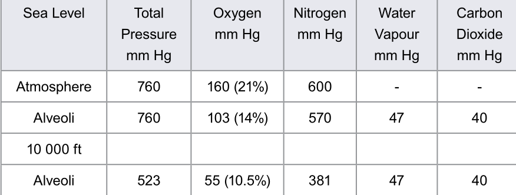
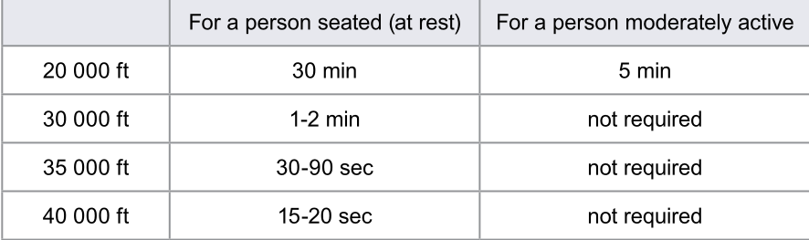
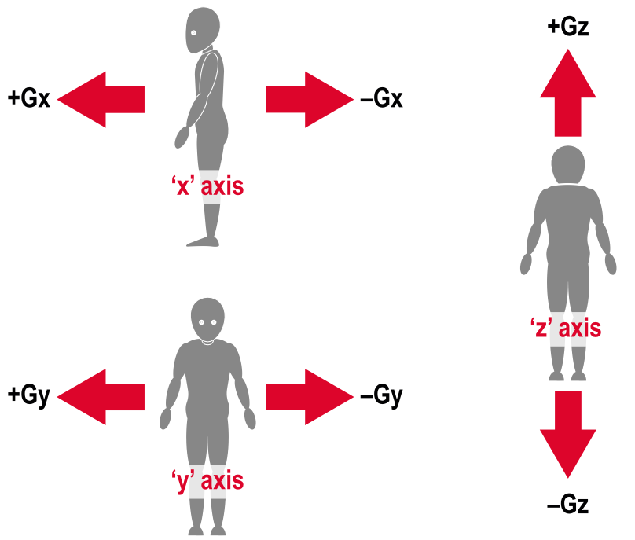

# Hypoxia, Hyperventilation, Acceleration
## Hypoxia
- Hypoxia is a reduction in the bodies' oxygen supply
- Sometimes called Anoxia
    - Anoxia is the total absence of oxygen supply
- Occurs when the body is short of hemoglobin oxygen saturation
- Hypoxia in aviation is Hypoxic Hypoxia 
- The amount of oxyhemoglobin depends not on the percentage of oxygen in the air, but amount of oxygen in the lungs
    - This means low external air pressure can cause hypoxia as can a change in proportion of the gasses in the lung
- The amount of oxygen in the air can be described as its partial pressure in mm Hg 
    - Sea level pressure is 760 mm Hg, but only 160 mm Hg is oxygen
    - Therefore 160 mm Hg is the partial pressure of oxygen at sea level
    - As altitude increase partial pressure of oxygen falls with the atmospheric pressure, but not at a constant rate
    - Rate of change of pressure is greatest as we climb from sea level, and decreases with altitude
- The effect of lowing external air pressure is exacerbated by the relatively constant partial pressures of carbon dioxide and water vapor
     - At sea level though oxygen makes up 21% of the atmosphere, in the lungs its only 14%
     - Partial pressure of oxygen in the lungs in 103 mm Hg
     - As altitude increase the partial pressure of oxygen in the atmosphere falls
     - and Proportion of oxygen in the atmosphere remains the same
     - As well partial pressure of water vapor and carbon dioxide in the lungs remain the same
        - reducing partial pressure of oxygen in the lungs still further

### Physical Thresholds
- Human body is extremely sensitive to reduction in the partial pressure of oxygen in the lungs
- Hypoxia effects are divided into 3 thresholds, exact height of when you will experience such symptoms varies
- Altitudes are
    - Reaction Threshold (beyond 7000 ft)
        - See a definite reaction from the body with lower levels of oxygen saturation in the blood
        - Performance of complex tasks may be impaired
        - Slight increase in breathing and heart rate is detected
    - Disturbance Threshold (10-12000ft)
        - Breathing produces significantly lower sats
        - Body's defense mechanism begins to generate cardiovascular and respiratory responses to try to protect against hypoxia
        - Body will struggle to cope even with short exposure
        - Impaired Judgement, memory and alertness
        - Short term memory may be impaired above 12 000ft
        - Drowsiness will begin set in
        - Further increase in alt will produce euphoria, fatigue, dizziness and headaches
    - Critical Threshold (22 000ft)
        - Sats fall as low as 65-60%
        - Mental performance quickly deteriorates
        - Rapid onset of extreme dizziness and confusion
        - Total loss of consciousness and complete incapacitation will follow without warning

### Symptoms of Hypoxia
- Symptoms of Hypoxia
    - Difficulty concentrating
    - Degradation of Reasoning
    - Impaired Judgement, Mood Changes, Euphoria
    - Drowsiness, light headaches, dizziness, nausea and lethargy
    - Loss of muscular co-ordination
    - Pallor and Cyanosis, bluing of the extremities due to low oxyhaemoglobin levels
    - Failure of basic senses, especially color vision, above 5000ft
    - Unconsciousness, coma and death

- The feeling of Euphoria induced by hypoxa is potentially very dangerous espically for pilots flying alone
- The Severity of hypoxia depends on the rate of decompression, physical fitness, flight level and individual tolerance
- Onset can be effected by many factors such as:
    - Excercise
    - Cold
        - Increases the bodys demand for oxygen as it burns carbohydrates to generate heat
    - Illness
    - Fatigue
    - Use of Drugs, including Alcohol
    - Smoking

### Time of Useful consciousness
- The length of time when an individual can act with both mental and physical efficiency and alertness
- Measured from the moment you are exposed to hypoxia. 
- Varies with altitude 

- TUC for people already short of oxygen in a pressured cabin (7-8000ft) are half of the table values
- Blood donors increase susceptibility to hypoxia

## Hyper Ventilation
- Caused by an unwarranted increase in breathing, resulting in a reduction of CO2 in the blood
    - results in a change of acid balance in the blood
    - Leads to a reduction in the diameter of arteries supplying the brain
    - Increasing the rate of breathing
    - Symptoms are very similar to hypoxia
    - Can be caused by psychological reasons
- Symptoms are
    - Dizziness
    - Tingling of extremities
    - Visual Disturbances
    - Hot and Cold flushes
    - Anxiety
    - Impaired performance
    - Loss of consciousness
    - Prolonged cases can result in severe muscle contractions of limb extremities
        - Known as 'Carpopedal Spasms'
        - May become fixed contractions 'tetany' if the sufferer becomes unconscious
    - Hyperventilation is self correcting
        - Once the body looses conciousness, its automatic controls take over to restore normality
        - if any doubt about diagnosis **treat for hypoxia**
    
### Anemia
- Lack of oxygen carrying capacity
- Caused by, bloodloss and resultant decrease in haemoglobin
    - or alteration of haemoglobin its self
- Anemic Hypoxia can be caused by smoking due to oxygen not binding to haemoglobin 
 - Circulatory shock is a failure of blood supply, caused by a heart attack

### Histotoxic Hypoxia
- Cell is impaired and can not use oxygen
- Narcotics/Drugs are the main cause

## Decompression Sickness
- Occurs when prolonged periods are spent at high altitude
- dissolved gasses in the blood, particularly nitrogen, can emerge into the body as bubbles of gas
- Decompression sickness can occur even when oxygen supply is adequate
- May appear some time after the flight
- Depending on where bubbles form syptoms will vary in nature and severity
    - The Bends - Pain in the joints
    - The Creeps - Itching of the skin, possible rash
    - The Chokes - Pains in the chest with a cough
    - Partial loss of vision
    - Paralysis of Limbs
    - The Staggers - Collapse leading to unconsciousness and death

- Procedure when decompression sickness syptoms arise is to descend ASAP and land ASAP
- Treatment is to be placed in a compression chamber on 100% oxygen and kept warm

## Acceleration
- 3 Types:
    - Linear acceleration - occurs in crashes and crash landings and buffeting
    - Radial acceleration - occurs when the aircraft turns about a distant axis, e.g. loop or level turn
    - Angular Acceleration - occurs when the rate of rotation changes
- Broken into 3 axis - based on alignment of human spine
    - fore and aft axis is X
    - Lateral axis is Y
    - Vertical Axis is Z

### Z Acceleration
- Body can take short term exposure of as much as 25G in the vertical axis
- Sustained acceleration results in decreased limits
- Forces in excess of +1G drive blood to the lower body
- Approaching +3.5G in a relaxed person, 'greying out' will occure
    - lack of blood to eyes and brain
    - tunnel vision
    - loss of peripheral vision
    - ultimately black out and unconsciousness
- Clamping leg and stomach muscles reduces this effect and delay onset till 7 or 8g
