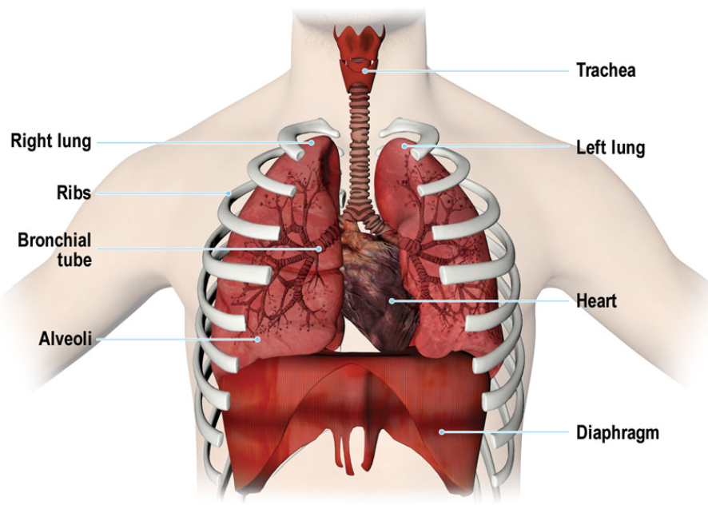

# Respiration

## The Atmosphere
- ICAO ISA is used to consider anything with the air we breathe, fly and operate in
- ISA at sea level is 
    - Pressure: 1013.25 hPa
    - Temperature: 15 °C
    - Lapse Rate: -6.5 °C/km (1.98 °C/1000ft)
- From 11km (36000ft)
    - Pressure: 226.00 hPa
    - Temperature -56.5 °C
    - Lapse Rate 0 °C/1000ft
    
- From 20km (65 000 ft)
    - Pressure: 54.70
    - Temperature -56.5 °C
    - Lapse Rate: +0.3°C

- ICAO ISA continues up till 32km (105 0000ft) where:
    - Temperature is -44.5°C
    - Pressure is 8.68° hPa

## Pressure change with Altitude
- at 10 000ft pressure is roughly 3/4 of the pressure at sea level (700 hPa)
    - Amount of usable oxygen for the body is 70% compared to sea level
- At 18 000ft pressure is roughly 1/2 of pressure at sea level (530 hPa)
    - Usable oxygen for the body is 52% compared to sea level
- At 36 000ft pressure is roughly 1/4 of sea level pressure (250 hPa)
    - Usable oxygen for the body is 25% when compared to sea level

## The Gas Laws

### Boyles Law
- States that a volume of gas is inversely proportional to its pressure 
    -  Volume α 1/Pressure
    - Or Volume * Pressure = Constant
- As pressure increases volume must decrease or vice versa
- As we climb to altitude in unpressurized aircraft gases, such as those trapped in the body, will expand
- A volume of gas at sea level will expand to approx twice its original volume at 18 000ft
    - and nearly 9x its volume at 50 000ft 

### Charles' Law
- A Volume of gas varies directly with temperature
    - Volume α Temperature
- If temperature increases, volume increases, if pressure remains constant

### Dalton's Law
- Pressure of a mixture of gasses is the same of the partial pressures of its constituents
    - So if 21% of the atmosphere is oxygen - 21% of the atmospheric pressure is due to oxygen
- Sometimes referred to as Law of Partial Pressures

### Flick's Law
- Gas will diffuse from areas of high concentration to areas of Low concentration
- Sometimes referred to the gas diffusion law

### General Gas Law
- Product of initial pressure, initial volume and new temperature of an enclosed gas is equial to the product of the new pressure, new volume and initial temperature
    - P1 V1 T2 = P2 V2 T1

### Henry's Law
- Amount of gas dissolved in a liquid is proportional to the pressure of that gas over the liquid
- Important in aviation as the behavior of gas in a liquid has relevance in both respiration and in decompression

## How We Breathe
- We use the muscles of the chest and diaphragm to draw and expel air from the lungs
- Lungs transfer oxygen into the blood stream and carbon dioxide is removed
- Circulatory system carries the gases in the blood to and from the tissue

- In normal breathing the active movement is inhalation
    - Ribs or more particularly the muscles between them (Intercostal muscles) and the diaphragm expand the chest cavity and draw air into the lungs
- With shallow breathing most movement comes from the diaphragm
- With heavy breathing intercostal muscles have a greater role
- Once the intercostal muscles and diaphragm are relaxed, air in the lungs is exhaled
- External respiration at rest occurs between 12 and 16 times a minute 

## Alveoli
- At the end of the finest bronchial tubes are bundles of small globular structures called alveoli
- Walls are only one cell thick and surrounded by fine blood vessels
- This is where the gas transfer takes place

## Lung Capacity
- Total lung capacity (approx 6000ml) is made up of **Vital Capacity** and the **Residual Volume**
    - Vital Capacity is the difference between the capacity of the lungs after maximum inhalation and capacity remaining after maximum exhalation (approx 5000ml)
    - The volume remaining after maximum exhlation is the residual 
    
- Total lung capacity may also be divided into the **Inspiratory Capacity** and the **Functional Residual Capacity**
    - **Inspiratory Capacity** is made up of the **Resting Tidal Volume** and the **Inspiratory Reserve Volume**
    - Resting Tidal Volume, is the volume air going in and out of the lungs during normal respiration
    - When working the body demands more oxygen and breathing increases in rate and depth
    - Extra air inhaled when the body is working is called the **Inspiratory Reserve Volume**
    - Functional residual capacity is the volume of air in the lungs when the body is at rest and normal expiration has occured
        - Comprimises of **Expiratory Reserve Volume** and residual volume, which will always remain in the lungs

## Gas Transfer
- In the Alveoli gas molecules will pass naturally from areas of high concentration to areas of low concentration
- Oxygen molecules pass through the cell walls into the blood to combine with hemoglobin in the red blood cells or corpuscles to form oxyhaemoglobin 
    - Gives blood its red colour
- More oxygen there is means more oxyhaemoglobin
- Oxygen is carried to muslces where it is metabolised with sugars carried in the blood to provide energy for the body to sustain life
- Waste products from chemical reaction between oxygen and carbohydrates are Carbon Dioxide and Water
- Metabolism of oxygen with carbohydrates in the cells is called internal respiration

- Waste carbon dioxide is carried from the tissues of the body dissolved in the colorless blood plasma as carbonic acid (H2CO3)
- Plasma transports the carbon dioxide to the lungs where it passes out to the atmosphere through the walls of the aveoli 
- Waste water is also carried in the blood
    - Some is used by the body's cooling mechanism and is lost as perspiration
    - The rest is removed from the blood by the kidneys and passed out as urine 
- The Rate of breathing is controlled by the amount of oxygen in the body, and amount of carbon dioxide waste product
    - CO2 concentration is more significant
    - Excess CO2 in the blood reacts with the nervous system to increase rate of exhalation and Inhalation

## Carbon Monoxide
- Carbon Monoxide, CO is formed when incomplete combustion takes place in a confined space
- It bonds with hemoglobin 200 times more effectively then oxygen
    - This means the body will not take in adequate oxygen
    - It also would not get the automatic reaction of increased rate and depth of breathing caused by a build up of CO2

- Carbon Monoxide poisoning is subtle, and rapidly leads to loss of consciousness and death
- Symptoms include:
    - Headache
    - Weakness
    - Nausea
    - Muscle Pain
    - Dizziness
    - In many respects "flu" like

### Detection and Treatment
- Can be detected by a carbon monoxide alarm
- If poisoning is suspected immediate measures that can be taken are:
    - Don oxygen masks if available
    - Switch of cabin heating (Especially if it is fed from bleed air)
    - Open fresh air vents if possible
    - Avoid Smoking
    - Land ASAP or divert if symptoms are persistent 
- Treated by administering 100% oxygen

