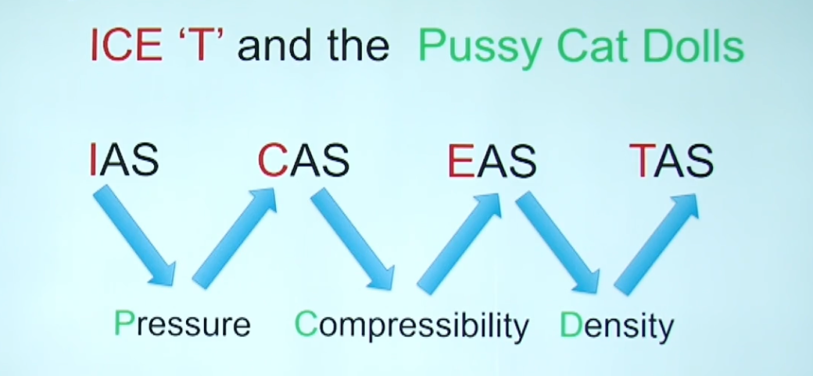

# Airspeed Indication

## IAS and TAS

- Dynamic pressure is the basic measure of airspeed in an aircraft
    - relates to fundamental handling of the aircraft, including speed at which it will stall
- Airspeed indicators are calibrated to read correctly at sea level ISA conditions
- At height air density reduces so for the same dynamic pressure reflects a higher TAS
- If air was warmer TAS would be higher than IAS
- Reflected in the formula
    - Dynamic Pressure = $\frac{1}{2} \rho V^2$.
    - if $\rho$ reduces then V must increase to maintain dynamic pressure
- IAS is based on dynamic pressure
    - Important for handling characteristics of the aircraft
- TAS is based on speed through the air
    - Important for navigation
- Mach number is also important
    - Speed of the aircraft in proportion to the speed of sound, Mach 1
    - Aircraft are generally not made to perform above Mach 1
    - Approaching Mach 1 aircraft will encounter buffeting "Mach Buffet"

- Normal to set IAS at low speeds and Mach number at high speeds

## Units
- Knots are the most common
- Conversions
    - 1 kt = 1 nm per hour
    - 1 nm = 6080 ft = 1852 m 
    - 1 sm = 1760 yards = 5280 ft

- Can use nav wheel to calculate by
    - Set inner wheel to value against one unit on the outer scale
    - Read directly off the conversion against the other unit

## Flat plate indicators
- Simple flat plate attached to wing strut on a bi-plane
- Dynamic pressure deflects plate backwards and a scale indicated airspeed according to deflection
- Calibrated at sea level under ISA

## Mechanical Airspeed Indicator
- Feeds pitot and static pressure to an ASI
- Pressure sealed case filled with static pressure
- Capsule inside is supplied with pitot pressure
- Aircraft speeds up and capsule expands
    - Amount of expansion indicates difference between pitot and static pressure (Dynamic Pressure)
- Mechanical linkage feeds movement to a needle which reads IAS
- In sea level ISA conditions this will read TAS
- Can be susceptible to temperature of the linkages but usually ignored
    - Can fit a bimetallic strip to correct

## ADC Driven Instruments
- Pitot and Static pressure are fed to an ADC
- Pressure is sensed by transducers or MEMS pressure sensors to be converted to electrical signals
- Airspeed can be calculated from pressure using formulae
- Calculates CAS

## Errors
### Instrument Errors
- Older instruments with more moving parts are more prone to instrument error
- Less moving parts suffer less
- All instrument errors are subject to regulatory limits

### Position Error
- More likely with poorly designed systems
- Not common in modern transport aircraft
    - If it does occur can be taken out in the ADC

## Calibrated Airspeed (CAS)

- IAS corrected for instrument and position errors
- Requires an ADC to correct
    - Large aircraft CAS = IAS

## Equivalent airspeed
- CAS calibrated for compressibility error
- CAS assumes air is incompressible and that density in dynamic pressure calculation is the same as the free air density around the aircraft
    - This is only the case at low speeds below 0.3-0.4 Mach
    - Above this air starts to behave as a compressible fluid 
    - Causes dynamic pressure to be greater than it should be and CAS calculated from dynamic pressure to over read
- Not required for ADC as it uses formulae to account
- Correction is always a reduction because compressibility causes CAS to be high
- Significant above 200KT CAS and 10 000 ft

## Density
- Correction for air density is required to calculate TAS from EAS

- Difference between IAS/CAS/EAS are small at low speeds and altitudes
- At high speeds and altitudes TAS can easily be twice as much as IAS/CAS/EAS

## Remembering the conversions

## Calculate TAS from CAS CRP 5
1. In *Altitude* Window alight temperature with altitude
2. on *Inner* dial find CAS and read TAS on the outside
3. If TAS **>** 300kts need to account for compressibility
4. Find *COMP. CORR* and use formula (TAS/100) - 3
5. Move window to the **LEFT** based on *COMP. CORR*
6. Read CAS on inner scale
7. Find Comp corrected TAS on outer scale

## ASI Colour Markings

- White arc indicates flap operating range from:
    - $V_{SO}$ : Stall speed at MAUW in landing Config
    - $V_{FE}$ : Maximum speed for flaps extended
- Green arch indicates normal operating range from:
    - $V_{S1}$ : Stall speed at MAUW Clean
    - $V_{NO}$ : Maximum operating Speed
- Yellow arc extends from
    - $V_{NO}$
    - $V_{NE}$ : Never Exceed Speed
- Some light pistons include
    - a blue line to mark $V_{YSE}$ : Best Single Engine ROC Speed
    - Another red line to mark $V_{MCA}$ : Minimum control speed with one engine Inop

## Pitot Static Blockages and Leaks
### Static Blockages and Leaks
- Static Blockage means the pressure in the instrument case remains the same
    - If we maintain height ASI reading will be correct
- If we descend Pressure alt in the case will be too low and instrument will **Over read**
- If we climb pressure alt in the case will be too High and instrument will **Under Read**
- If a static blockage is detected and you switch to alt static, detected static will be slightly low
    - there for instrument will overread slightly
- In a pressurised aircraft if the static line leaks it will read cabin static pressure
    - Cabin static pressure is usually higher than true static
    - Instrument will under read

### Pitot Blockages and Leaks
- If pitot becomes blocked, airspeed will not be correctly shown
- At a constant altitude airspeed will remain the same, regardless of if you slow down or speed up
- Reducing Altitude will increase static pressure
    - ASI reading falsely decreases 
- Climbing will decrease static pressure
    - ASI reading falsely increases
- Any leaks in Pitot line will lower pitot pressure and cause instrument to under read
- EFIS systems have a 'miscompare' function
    - Discrepancy between systems will alert pilots
- Other indications of unreliable airspeed are but not limited to:
    - Unexpected Aircraft behavior
    - Buffeting
    - Aircraft Systems Warning
    - Aircraft Attitude
    - Wind Noise

