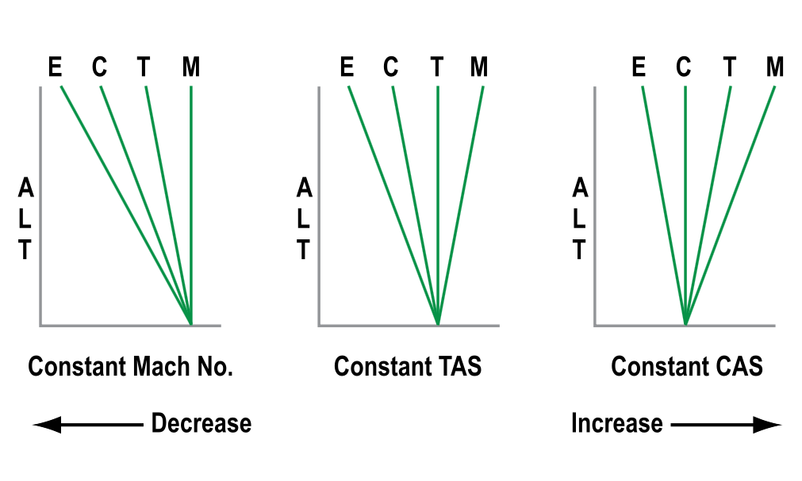

# Machmeters and ADCs

## The Machmeter

- Machmeter gives an indication of speed relative to the speed of sound
- At high altitudes it is usual to cruise at a Mach number ie 0.85

### The Local Speed of sound
- Speed of sound is not constant and changes based on the temperature of the air
- Warmer Air = Faster the speed of sound
- LSS = $38.94\sqrt{T}$
    - LSS = Local Speed of Sound
    - T = Static Air Temperature in Kelvin
- Can be calculated on the navigation computer by:
    1. Turn **AIRSPEED** window until bold arrow marked **Mach No Index* becomes visible and set against the air temperature
    2. On the **Inner Scale** find number 10 (Standing for Mach 1.0)
    3. Opposite 10 will read **LSS**

- Mach No. can only be calculated if TAS and LSS are known
- Mach No. = TAS/LSS

### How the Machmeter Works
- Mach No. is a function of the dynamic pressure divided by the static pressure
- It is independent of air temperature
    - LSS is affected by air temperature
    - TAS is affected by air temperature
    - The ratio between them remains unchanged as temperature changes
- For any given flight level (Static Pressure) and CAS (Dynamic Pressure) there is only one mach number
    - It is unaffected by temperature changes

#### Constuction
- First generation equipment contains the elements to find dynamic pressure
    - A capsule fed with pitot pressure inside a case fed with static (Which is an ASI)
    - An altitude capsule to find Static pressure
    - Airspeed capsule through linkages moves a ratio arm in the direction marked AB
    - Effect on the Ranging depends on how the altitude capsule moves in direction CD
    - Ratio arm ultimatly moves the pointer that indicates Mach No. 

- Second Generation instruments are either servo driven indicators fed from the ADC or are EFIS Displays
- ADC calculates Mach No. from dynamic pressure and static pressure inputs

### Errors
- Machmeters only suffer from instrument error and pressure error
    - Because these 2 errors are very small the indicated Mach No. can be said to be the True Mach No. 

### Blockages and Leaks
- If Pitot source becomes blocked it will encounter the same errors an ASI
    - Remains unchanged when level
    - In a climb it will over read
    - In a descent it will under read
- If the pitot line leaks it will under read

- If static sources become blocked
    - In a climb it will under read
    - In a descent it will over read
- If the static line fractures in the pressure hull
    - it will under read

## EAS/CAS/TAS Relationship

- ECTM diagrams help to remember relationship between EAS/CAS/TAS and Mach No.
- Normal Atmosphere sequence left to right is always drawn ECTM
- Draw parameter that will be held constant as a vertical line
- Movement to the left is a decrease
- Movement to the right is an increase

## Crossover altitude

- Airliners climb on CAS until reaching a "Crossover Altitude" where they switch to Mach. And Vice Versa for descent
- In a climb a constant CAS could result in inadvertently straying into transonic region
- In a descent at a constnat Mach. the increasing CAS could easily mean Vmo is exceded

## Isothermal/Inversion Layers

- If asked about cimb or descent through a layer where temperature stays constant **(Isothermal**)
    - Draw the T and M lines together then use ECTM diagram as before

- If asked about climb or descent through a layer where temperature increases with height **(Inversion)**
    - Draw ECTM with T and M swapped around (Inverted)

## Air Data computers
- ADC requires inptuts from a variety of sensors, specifcally
    - Static Pressure
    - Total Pressure
    - TAT
    - Angle of Attack
    - Flap and landing gear position
- It computes and corrects this information to provide
    - Pressure Altitude/Barometric altitude using static pressure
    - CAS, Correcting for known pressure/position errors
        - Thus for most modern aircraft IAS = CAS
    - TAS, computed from pitot and static pressure
    - SAT, by applying ram rise and recovery factors to TAT
    - TAT, displayed as raw data if required
    - Angle of Attack, Displayed on EFIS, Seperate instrument and used in Stall protection Systems
    - Vertical Speed, Either from rate of change of static pressure, or from an accelerometer in a strap down IRS, or a blend of both

- On some aircraft the ADC is integrated with the Inertial Reference Unit to create a:
    - Air Data Inertial Reference Unit (ADIRU)
    - Usually separate controls for the ADC part and IRU part
- Loss of an ADC is of less consequence than the loss of an individual analog pressure instrument due to redundcency provided by the use of dual ADC
- ADCs will cross compare and generate a 'Miscompare' Caution if a certain differential is reached 
- Most Dual ADC's have separate pitot/static feeds to standby instruments
- 