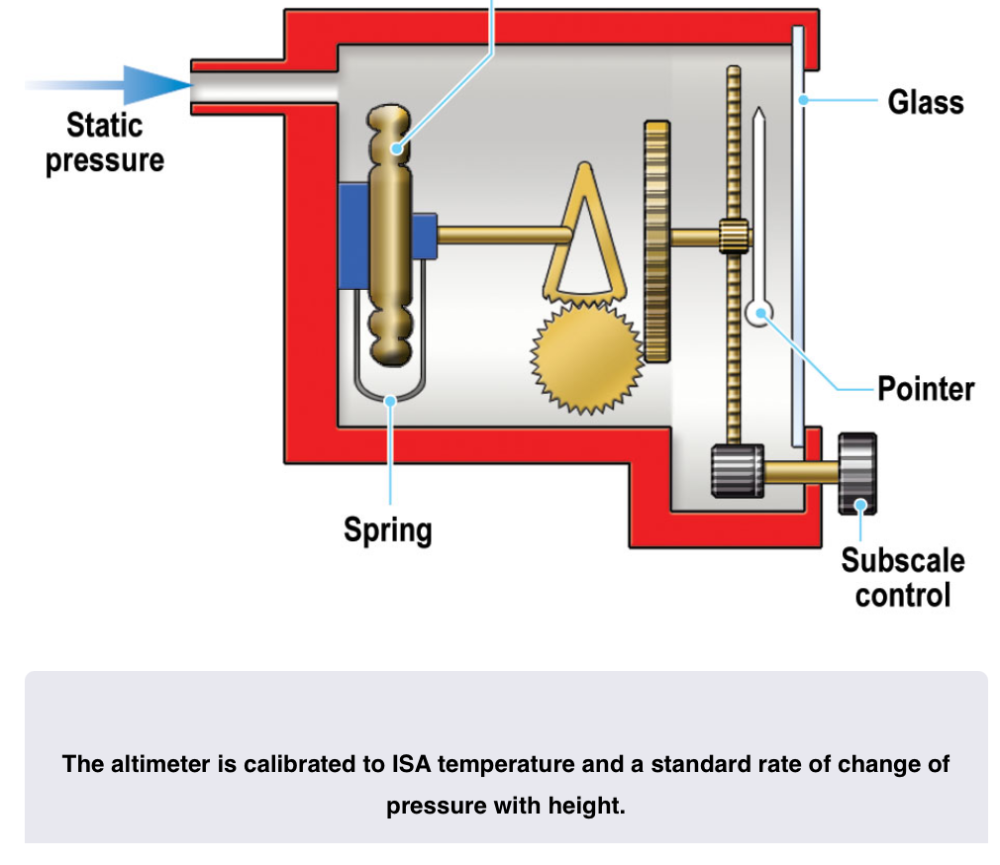
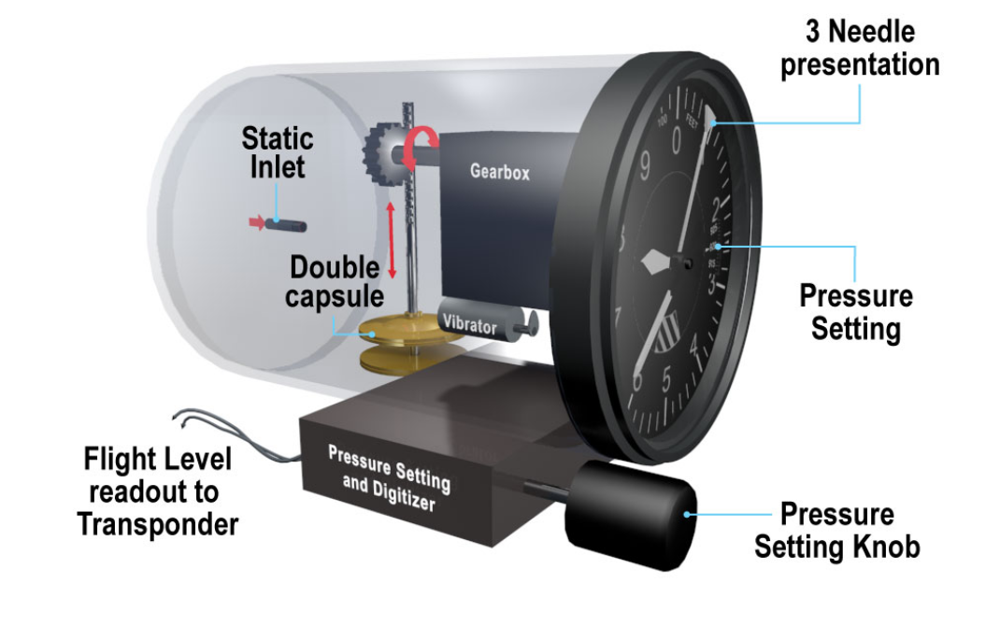
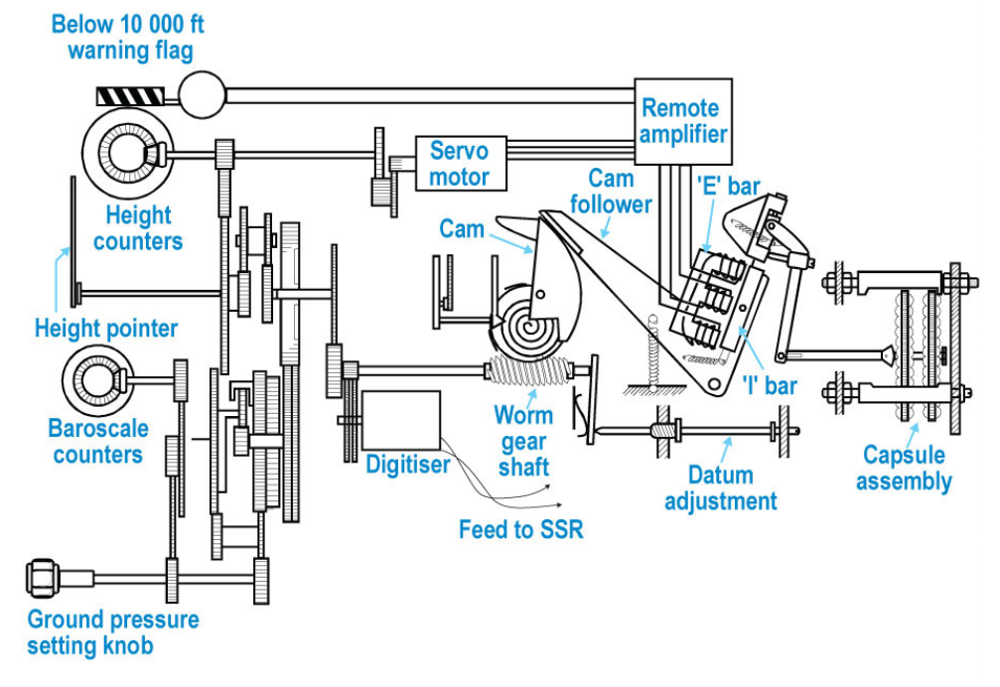
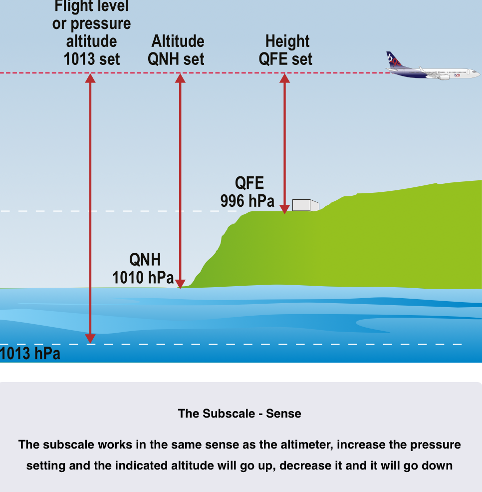

# Pressure Altimeters

## The Standard Atmosphere

- **Sea level pressure**: 1013.25hPa
- **Sea level air density**: 1225g/m$^3$
- **Sea level air temperature**: 15°C
- **Temperature Reduction**: 1.98°C/1000ft up to
    - 36 090 ft at -56.5°C staying constant till
    - 65 617 ft then rising at 0.3°C/1000ft

## Altimeters
- Indicate altitude of aircraft by detecting changes in the static pressure
- Three mechanical types
    - Simple Altimeters
    - Sensitive Altimeters
    - Servo-Assited Altimeters
- Modern systems calculate altitude in the ADC and output to an EFIS or Servo driven altimeter

### Simple Altimeters
- Linked to an [Aneroid Capsule](../Instruments/pressure-sensing.md/#aneroid-capsules)
- Aircraft asscends and static pressure decreases
    - capsule expands and dial rotates
- Aircraft decends and static pressure increases
    - Capsule contracts and dial rotates
- Includes a subscale setting to adjust to datum pressures
- Calibrated to read correctly at all heights due to linkage being non-linear

### Sensitive Altimeter
- Same principles as the Simple Altimeter but uses multiple capsules, increasing movement
- Can be fitted with vibrators to overcome static friction (stiction) and further improve the response to small altitude changes
- More complex gearing allows use of three pointers
    - Tens of thousands
    - Thousands
    - Hundreds
- Some have a digital display with a single pointer
- Can be fitted with a digitizer to send Flight level information to ATC transponder
- Both vibrators and digitizers require electrical supply

### Servo Assisted Altimeters
- Increased accuracy by not requiring a direct mechanical link between capsules and height pointers 
- Movement is transmitted to a pivoted bar (I-Bar)
- E Shaped bar with coils around the protrusions
- AC Supply is fed to center of the E Bar
    - when the air gaps between E and I are even, coils on outer limbs produce equal and opposite voltages
- I bar is disturbed and one limb of E bar produces a greater voltage than the other one
    - voltage difference is fed to an amplifier then to servo moter
    - through a feedback system repositions the I bar so air gaps are equal again
- Described as 'induction pick off' or 'electromagnetic pick off'

- No vibrator is needed to overcome 'stiction
- More complex gearing allows for higher indicating range
- Use drum and pointer display

### ADC Driven System

- Static pressure is sent to ADC to calculate altitude referenced to 1013 and subscale set by pilot
- reference to 1013 is sent to ATC
- subscale reference sent to a mechanical instrument or EFIS display

##  Units and Accuracy
- ICAO PANS-OPS sets accuracy requirements for altimeters
- Depends on test range (indicating range)
- Must show QFE or QNH accuratly with plus or minus
    - 20m or 60ft for altimeters with testing range of 0 - 9000m (0-30 000ft)
    - 25m or 85ft for altimeters with testing range of 0 - 15 000m (0 - 50 000ft)

- Most altimeters display feet
    - China and Russia use meters for altitude
    - 1m = 3.28ft
    - On EFIS aircraft altimeter can usually be changed between m and ft
    - Otherwise a table needs to be used

## Altimeter error
### Position Error
- Can affect altimeter readings
- Minimised by good design
- varies with TAS and Angle of attack

### Instrument Error
- Caused by friction in the gearing
- Overcome with vibrators
- Any capsule based system will encounter **Hysteresis Error**
    - Capsule becomes reluctant to change shape after being at one pressure for a period of time

### Barometric Error
- Any change of sea level pressure from the datum on the subscale will give an incorrect altitude reading
- Removed by adjusting the subscale to the correct value 
- If the subscale is not adjusted:
    - Going High to Low pressure - Altimeter will over read
    - Going Low to High pressure - Altimeter will under read

### Temperature Error
- Error arising when the temperature of the airmass differs to that of the ISA
    - Cold air occupies less vertical extent than hot air
    - Sea level pressure may be the same
- Implications are:
    - Going from Warm to Cold air - Altimeter may over read
    - Going Cold to Warm air - Altimeter may under read

**For both Temperature and Barometric error you can remember High - Low - High**

## Line blockages
- If the static line becomes blocked the instrument can not change
- If the static line fractures inside the pressurized hull, cabin altitude will be displayed
- If altimeter reading is suspected to be wrong GPS altitude may offer an alternative
    - Requires four satellites for a 3-D GPS fix
- Without GPS augmentation GPS altitude should not be considered accurate enough to replace pressure instruments

## Altimeter Pressure Settings
- **QFE**: Subscale setting where altimeter will read 0 on the ground
    - Airfield QFE is measured at the highest point on the airfield surface
    - Touch down QFE is measured at the touchdown point on the runway in use

- **QNH**: Subscale setting so altimeter reads altitude above MSL
    - Found by measuring QNH and increasing it to sea level assuming ISA temperature values
    - Airfield QNH gives altitude AMSL for the position of the aerodrome
        - Must be set on at least one altimeter when departing from an aerodrome in controlled airspace
    - Regional QNH is the lowest forecasted QNH for the next our within a pre-designated zone 
- QNH and QFF will only be the same if ambient conditions are ISA
- **Standard setting**: 1013.25hPa (29.92 inches)
    - Altimeter reads pressure altitude or flight level
    - Used above the transition level

- When answering questions relating to Flight levels, altitude or height it's best to draw it out similar to above
- Always put the biggest value (hpa at the bottom)
- Note 1013 (Flight level) is a standard and always remains in the same spot

## Density Altitude
- Pressure altitude corrected for temperature
- or Altitude in the ISA which gives the same air density as the prevailing Non-ISA combination of Temperature and pressure altitude
- Can be calculted on CRP5 by:
    - Set pressure altitude against temperature in AIRSPEED 
    - With out moving dial read off density altitude in DENSITY ALTITUDE window
- Alternativly can use formula
    - Density Altitude = Pressure altitude + (120 x ISA deviation)