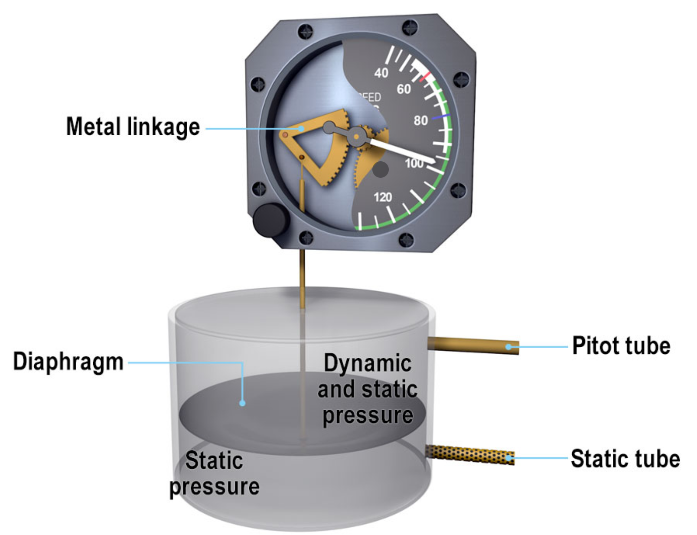
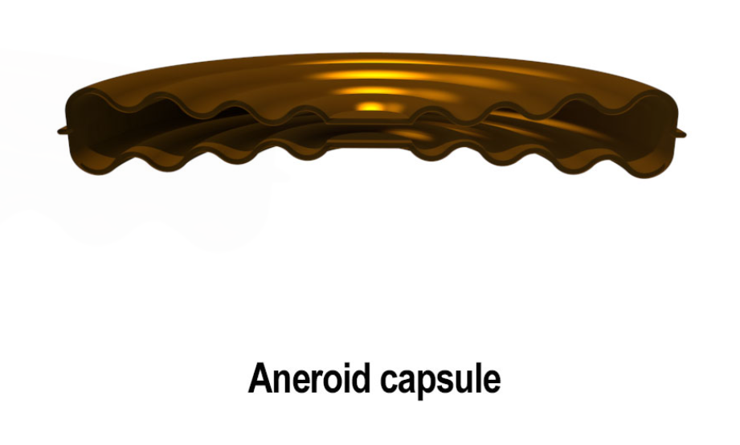
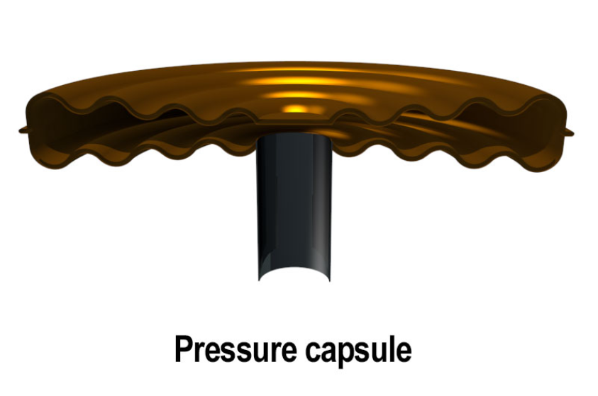
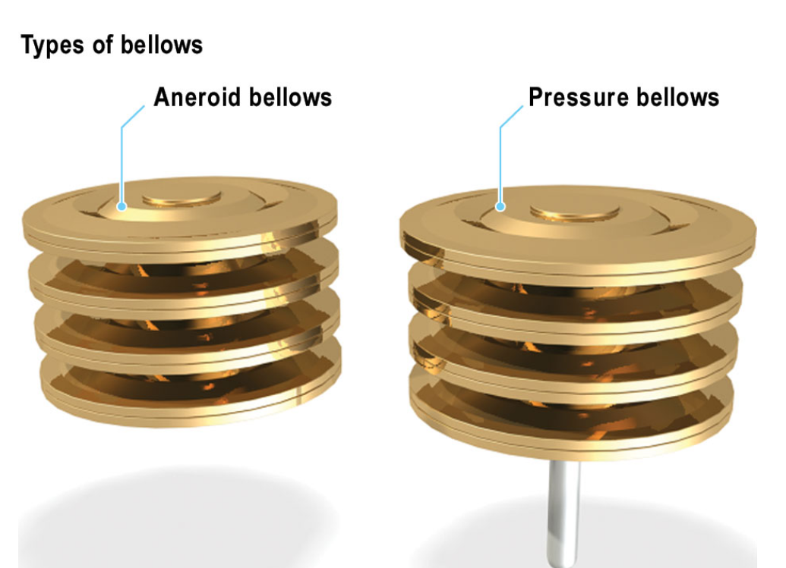
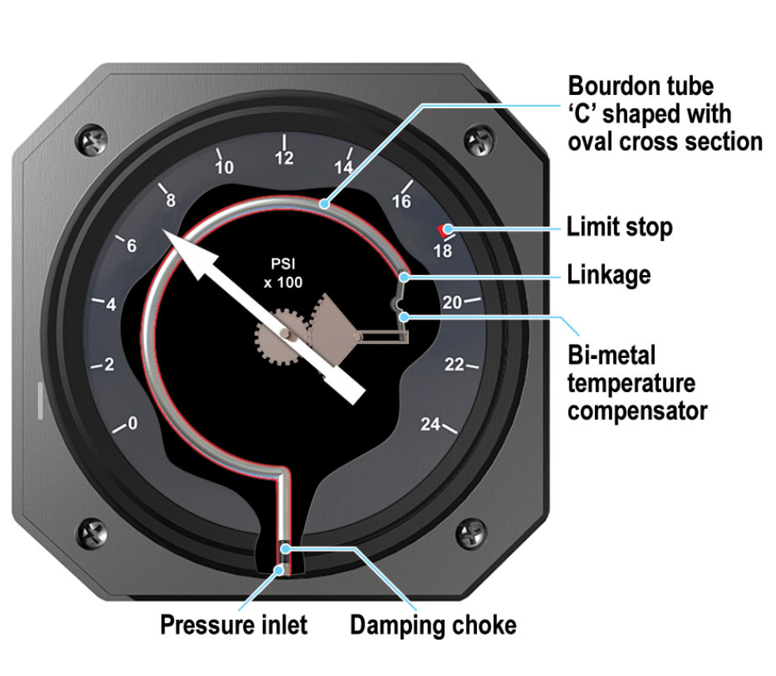
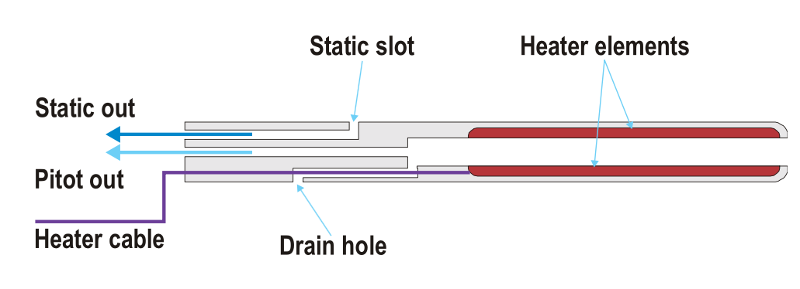
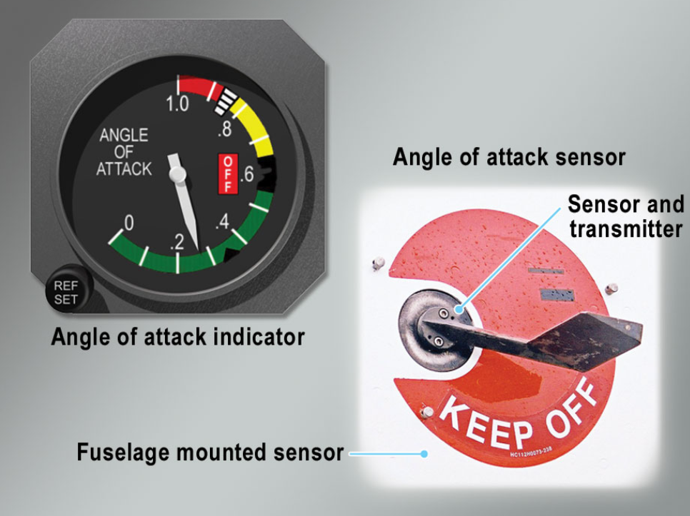

# Pressure Sensing

## Units and conversions
- Pressure is a force measured of a unit area
- Can be measured in
    - pounds per square foot (lb/ft$^2$)
    - pounds per square inch (lb/in$^2$)
    - Newtons per square meter (N/m$^2$)
        - Pascal (Pa)
        - Inches of Mercury (inHg)
        - Bar
- A bar is an approximation to sea level pressure, 100 000 pa
- Aviation uses hPa which is equivalent to 1000hpa
- Approximate conversion from lb/in$^2$ to bar is **1 bar = 14.5 PSI**

## Absolute and Differential pressure sensors

- Absolute pressure is the total pressure measured relative to a perfect vacuum 
- Differential pressure is how much pressure exceeds or is less than the absolute
- The sensors used to detect defferential and sometimes absolute pressure are:
    - A diaphragm
    - An aneroid Capsule
    - A Pressure capsule
    - Bellows
    - a Bourden Tube
    - Pressure transducers

### Diaphragms
- Thin discs fixed at the edges which distort under pressure
- distortion drives an indicator through a system of gears
- Rarely used to indicate system pressures, because maximum deflection of a diaphragm is small

### Aneroid capsules
- Sealed capsule with most of the air drawn out
- Very low internal pressure
- As the altitude increases the capsule expands
- Measures absolute pressure, but only a low range of pressure

### Pressure Capsule
- Like an aneroid capsule, but they are not sealed
- Fed with the pressure to be sensed
- Air outside capsule us usually at atmospheric pressure
- The distortion is a measurement of the extra pressure being sensed over and above atmospheric pressure
    - Detect differential pressure
- Still only a limited ability to expand and contract

### Bellows
- To increase the movement of capsules, they can be stacked together to make Bellows
- Can be completely sealed aneroid bellows or pressure bellows
- Allows for more expansion, so it can measure a medium range of pressures
- A spring can be used to return the bellow to their natural length once the pressure is removed
- Typical application would be to sense Engine Manifold Pressure

### Bourden Tube
- Tube is curved like a 'C' fixed at one end and has an oval cross-section
- Pressure is fed into the tube at the fixed end and the moveable end is sealed
- Tries to straighten out under pressure
- Movement, Via a magnifier linkage operates the indicating mechanism
- Linked to a gauge with temperature compensation
- They can indicate a large range of pressure but generally are associated with high pressure measurement

### Pressure Transducer

- A device that changes an input parameter such as temperature or pressure into a different output parameter, i.e. an electrical signal
- Pressure sensed by the transducer acts on a stainless steel diaphragm presses on a resistive element that changes its resistance depending on strain 
    - Can be referred to as a strain gauge

- Wired into a [Wheatstone bridge](../Instruments/principles-and-sensors.md/#resistive-sensors-resistive-temperature-detector)
- Not independent of aircraft electrical system
- Advantage is it can indicate remotely
    - Simply measured desired parameter at source and send signal back to the gauge

## Pitot Static System

### Dynamic Pressure
- An aircraft sitting stationary will be subject to static air pressure
- As it moves through the air wind resistance, pressure acting on the front of the aircraft
- Dynamic pressure is proportional to aircraft speed through the air
    - Dynamic Pressure = $\frac{1}{2} \rho V^2$.
    - $\rho$ = Air Density
    - V = True velocity of the aircraft
- Important because it represents the pressure of air flowing over the aircraft, which in turn relates to the lift and drag it experiences

#### Static Pressure vs. Dynamic Pressure

| **Pressure Type**   | **Definition** |
|--------------------|------------------------------------------------|
| **Static Pressure**  | Atmospheric pressure |
| **Dynamic Pressure** | Kinetic energy of the air converted into pressure energy |

### The Pitot Tube
- Records the total pressure acting on the front of an aircraft
- Total Pressure = Dynamic pressure + Static Pressure

### Finding Dynamic Pressure

- To find dynamic pressure we need to sense static pressure
- Dynamic pressure = Total pressure - Static Pressure

### Static Ports

- Used to sense static pressure
- Holes in the port are placed at right angles to the airflow to avoid detecting dynamic pressure

### Combination pressure head
- Combines the Pitot and Static pressure sensors into a single head
- located outside boundary layer
- Heater element prevents ice blockage
- Drain hole allows water to drain away

### Large Aircraft systems
- Large aircraft have more complex systems to give independent feeds to Capt and F/O systems
- Fed through an 2 Air Data computers

### Position Error
- The sum of any error detected in the detected static pressure
- Two sub categories
    - Configuration Error (Predictable)
    - Maneuver Error (Not Predictable)

- Varies with TAS and AOA

#### Configuration Error

- Error induced by the configuration of the aircraft
    - Flaps, Speed, Undercarriage Position, AOA
- Calculated in testing and accounted for
- May not be accounted for in standby instruments 

#### Maneuver Error

- Error induced by Rolling, Pitching or Yawing or Random wind gusts
- Can not be programmed out
- Not common on large aircraft due to lack of extreme maneuvers
- Can be minimized with connected static ports on both side of the fuselage

## Angle of Attack Sensors

- AOA is referred to as "Alpha" $\alpha$
- Angle between the Chord line and relative airflow
- More important near the stall and in emergencies as it defines stall in all conditions of flight
- Two Sensor forms:
    - Vane that is free to line up with Relative Air Flow
    - Conical probe with slots above and below the zero alpha datum which measure relative pressure

### Vane Type Sensor

- Small airfoils free to rotate and line up with relative airflow
- Positioned clear of any airflow influenced by wings or engine pods
- Position is measured by a transducer (synchro-transmitter) and set electrically to flight systems
- Heated to prevent Ice

### Pressure Type Alpha Sensor

- Conical probe at right angles to the airflow
- Free to rotate in the airflow with sensing holes or slows at 90° to each other
- Difference in recorded pressure causes the probe to rotate in the airflow until pressures are equal and RAF is determined
- Potentiometer feeds the probe position to the ADC
- Heated to prevent Ice
