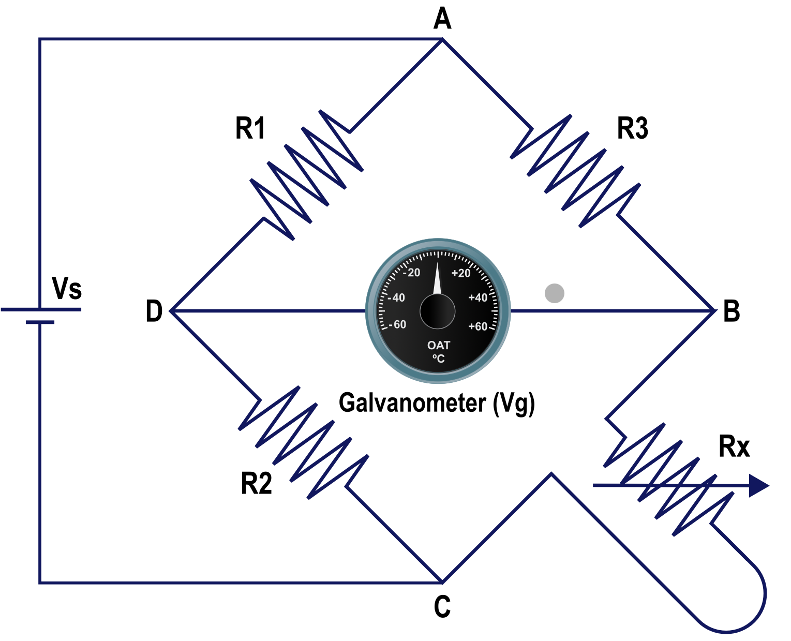
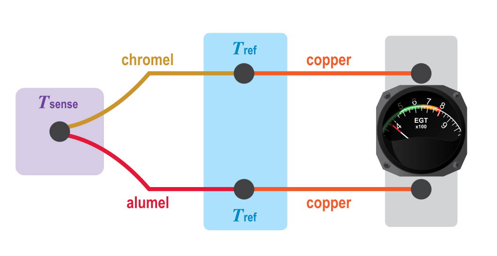
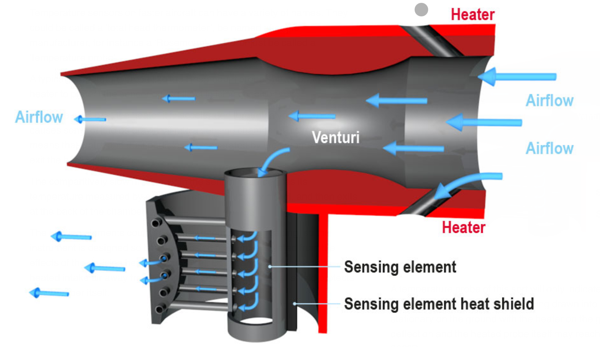

# Principles and Sensors

## Sensors

### Direct Sensors
- Data is fed directly from the sensor into the instrument

### Servo-Driven indicators
- Data is fed into a central computer and converted into electronic signals to drive needles and indicators

## Temperature

Sensors will use °C, °F, °K

- Because °C and °K are the same unit size °K is always numerically bigger than the temperature in °C

- To calculate degrees °K from °C we can use °C + 273
	- ie: -55°C + 273 = 218°K

- To convert °F into °C it is best to use the navigation computer
	- Or °F = (°C x 9 / 5) + 32

## Temperature Sensing

There are four primary types of temperature sensors

- Bimetallic Sensors
- Resistance Sensors
- Thermocouples
- Radiation Pyrometers 

### Bimetallic Sensors
- Uses two different pieces of metal coupled together. When one is heated it will expand more than the other causing a flat strip to bend or coil to uncoil

### Resistive Sensors (Resistive Temperature Detector)

- Relies on temperature change of a pure metal (ie, platinum nickel or copper)
- Operate in wider range of temperates (-200°C to 600°C)
- Sensing resistor (Rx) is a resistor in a Wheatstone Bridge

- Resistors R1, 2 and 3 are all of a known value.
- If value of Rx is the same as the other resistors there would be no volt difference across the bridge (between point B and D)
- If Rx was at a difference resistance there would be voltage across the bridge, detected by the galvanometer and converted to temperature. 
- Need a DC power supply to work.
- Changes in supply voltage do not affect indications

### Thermocouples

- Used for very high temperatures (ie exhaust of a jet engine)
- Relies on dissimilar metals which create an electrical potential at their junction which is proportional to the temperature 
- Sometimes called Thermal EMF
- Usually made with Chromel and Alumel
- Consists of two junctions
	- a 'hot' juction in the hot area (Tsense)
	- a cold 'reference' junction (Tref) which must be at a known temperature
- When there is a temperature difference between the two junctions a small potential difference is created
- Conventional copper wiring carries the voltage to a galvanometer which converts it to a temperature

- can be expressed in a formula 
	- $E=K\cdot Th$
	- $E$ = electromotive force
	- $Th$ = Hot Junction temperature
	- $K$ = a constant
- They are wired in parallel so the failure of one does not cause the total failure of the system
- Advantages are
	- They do not need to be powered to operate
	- Depending on material can sense between -200°C and 1250°C
- Disadvantage is they are inaccurate

**Radiation Pyrometers**

- For even higher temperatures, when the frequency of radiated energy is into the visual spectrum a radiation pyrometer can be used 
-  Measures the frequency of the emitted radiation from the area to be examined
- Normally used to measure Turbine Blade temperatures at the turbine inlet area of a jet engine

## Air temperature probes

Two types of probes are used in aircraft for measuring temperature

- Expansion type:
    - Uses a bimetalic strip which can be referred to as a direct reading probe
- Electrical Wire/Resistance type
    - Relies on change of electrical resistance with change of temperature
    - Also referred to as the remote reading type 

**Light Aircraft Temperature Sensors**
- Normally use the bimetallic type
- Probe is mounted high on the windshield with indicator inside and sensor outside 
- External sensor has a sun shield over it but no anti ice protection
- Only sufficiently accurate for low speed aircraft

## Problem of speed
- A faster aircraft creates a temperature sensing Problem
- As air flows past frictional heating will distort the result
- If the previously static air is brought up to the same speed as the rest of the aircraft as its temperature is sensed the extra energy imparted will increase the sensed temperature
- Referred to as:
    - Kinetic heating
    - Ram Rise 
    - The Ram Rise in temperature due to adiabatic compression
- Systems on faster aircraft will display the air temperature as Static Air Temperature (SAT)
    - The temperature of the undisturbed air temperature
    - Can also be referred to as Outside Air temperature (OAT)
- Will also display as True Air Temperature (TAT)
    - Air Temperature including Ram Rise
    - Can also be referred to as 'Measured impact Temperature'

- Can be calculated in a formula that depends on the aircraft's Mach number ($M$)
    - $SAT \times (1 + 0.2M^2) = TAT$
    - Temperatures are always input and output as Kelvin
    - This is based on total conversion of kinetic energy to heat, Sensing systems rarely achieve this or want to achieve this 
    - Formula needs the addition of a constant (Which value is always less than 1)
    - Values around 0.9 are typical
    - Displayed as $K$ (Not to be confused with Kelvin)
    - Formula now becomes $SAT \times (1 + 0.2KM^2) = TAT$ or the other way around $SAT = TAT ÷ (1 + 0.2KM)$

## Temperature sensors on faster aircraft
- Variety of names such as:
    - Total Head Thermometer
    - Rosemount Probe
    - Temperature Probe

- Has a heater to protect it from ice during flight 
- Once air passes heater it is accelerated through a venturi causing some air to be drawn into a sensing chamber
    - This allows dust and water to be separated by their momentum and exit back of probe
- Air in the sensor chamber has is measured by a resistive element, usually nickel and then exits the back of the chamber
- Heating element can affect air temperature reading, so It's designed that the sensing element is isolated from the effects of the de-icing heater
- Boundary layer bleeds take heated intake air away from the sensor chamber and a heat shield protects the chamber its self
- Probe will only indicate correctly when the aircraft is moving due to reliance of air being drawn into the sensing chamber

## Indications

- Flat plate temperature sensors where sensing element is flush against the aircraft surface
- Sensors of this type do not suffer from Ram Rise
- Affected by frictional Heating
    - Can be taken out by calculation

## Temperature Measurement Errors

### Air Temperature Measurements are subject to 3 errors
- Instrument Error:
    - Caused by imperfections in the manufacturing
    - Can be compensated for by fine calibration of the instrument
- Environmental Error:
    - Caused by solar heating or ice accretion
    - Heating used to prevent Ice
    - Usually placed on the underside of an aircraft or in a sun shield
    - Can not be compensated for 
- Heating Error
    - Comes from either Ram Rise or Frictional Heating
    - Only an "error" when you need to find the SAT
    - Can be fully compensated for with calculations

## Time Measurement
 - Modern aircraft use an electronic clock called a 'System Clock' which provides 'System Time'
 - They can be manually reset
 - Can update from external time references, like GPS data
 - More basic aircraft still require a clock

 ## The Hobbs Meter

 - Records hours and tenths of hours
 - May be activated by
    - Electrically from powering up the aircraft
    - By oil pressure when the engine is running
    - Weight on Wheels switch
    - Airspeed sensing vane to record flight time

## Accelerometers

- Used to display load factor
- Simple accelerometer uses a weight on a spring where accelerating extends or compresses spring
- More sophisticated accelerometers use a weight suspended on a thin metal blade. 
    - Acceleration in one axis will only move the weight off center
    - Weight forms the I-Bar of an E and I-bar system
    - Input signal is sent to the center coil of E bar
    - When the I-bar is centralized the flux at the two ends will be equal
    - Output coils are wound in opposite directions, so the flux detected in each leg will cancel out the other
    - When the weight is displaced the flux in the ends of the E-bar will no longer be equal and a signal is generated 

### MEMS Accelerometers

- Modern IRS use Micro Electro Mechanical system accelerometers 
- Works in the same way as a traditional accelerometer by sensing displacement of a mass as either a change of resistance or capacitance
- IRS will have 3 Accelerometers to sense acceleration in all 3 planes
- Can provide acceleration out puts to the
    - Flight Data Recorder
    - Autopilot and Flight Director
    - Yaw Dampers
    - Autobrake system
    - Any other system that requires acceleration information