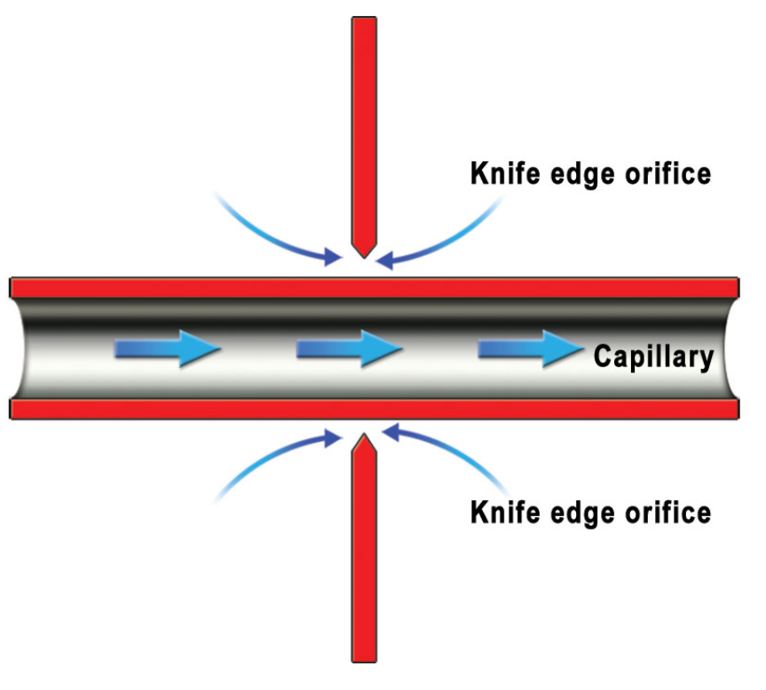
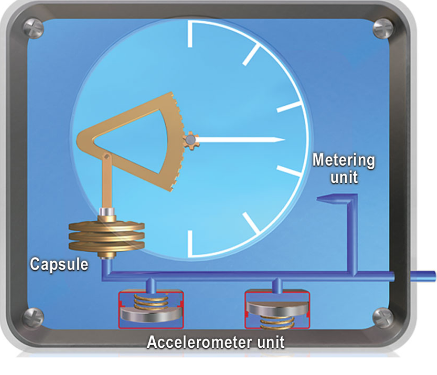

# Vertical Speed Indicators

## The Simple VSI

- Pressure operated VSI uses the change in static pressure to determine a climb or descent
- Static feed passes into a capsule as well as the case
- Static feed to case passes through a metering unit
    - When the aircraft changes altitude the capsule responds immediately
    - Pressure change in case is slower
    - Will maintain differential pressure only whilst in climb or descent

- Metering unit must be carefully designed to give a change of capsule pressure directly related to real rates of climb or descent
- Metering unit uses a "Choke" which directs air through the capillary tube and a knife-edge orifice

- Metering unit is self compensating by design for pressure alt and temp
    - At height air density is less
    - Capillary allows pressure difference between the capsule and case to increase
    - Orifice balances this by reducing the pressure difference
    - Orifice allows pressure difference to increase with reducing temperature
    - Capillary balances it by reducing the pressure difference with reducing temperature

## Instantaneous VSI (IVSI)

- Simple VSI will not show rate of climb or descent immediately, there is a time lag while pressure difference builds up
- IVSI counter this with two weights centered with springs (dashpots)
- Cause an immediate pressure difference because of their inertia as the aircraft enters a climb or descent
    - can be referred to as accelerometers
- Once stabilized in a climb or descent weights are centered by their springs
- As the aircraft levels out they act in opposite sense, reduce ROC or ROD instantly
- Dash pots can be effected by acceleration on the aircraft normal axis 
- Rolling into a steep turn they will initially show a climb, if turn is maintained will return to zero
- Should not be relied on up for turns of 40° or more, or when load factor in turn is changing 

## Other Systems

- If the aircraft has a modern strap down IRS, vertical acceleration and velocity will be available from that system
- If barometric height is available from an ADC, rate of change of height can be displayed as vertical velocity
- Dynamic vane VSI
    - difference between static and metered static pressure induces flow over movable vanes
    - movement of vanes records a vertical speed

## Units
- Most aircraft will display in Ft/min 
- Some could show m/s
- 1000 ft roughly equals 5 m/s

## Static errors
- Change of static pressure when none is due will give false indication
    - therefore susceptible to maneuver error 
    - particularly during take off, go around and in turbulence
- Static blockage will cause pressure driven instruments to read 0 in all circumstances
- Static leak to the pressure cabin will cause instrument to read cabin climb/descent
- On start up all VSI's should read 0
    
